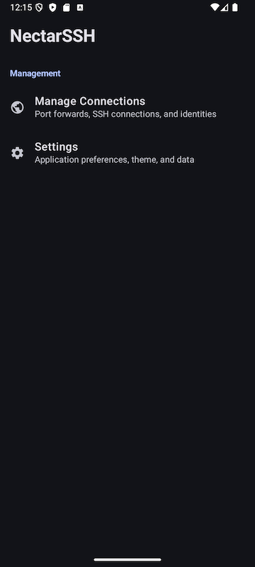
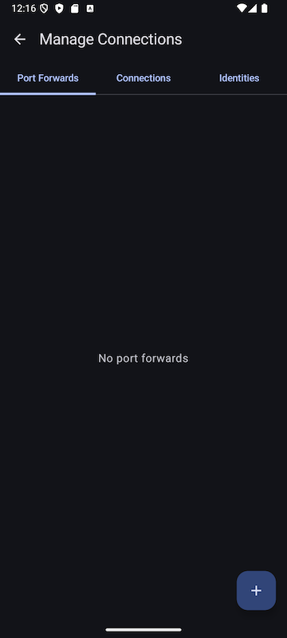

 
# NectarSSH

A sleek Android SSH tunnel manager built with Kotlin and Jetpack Compose.

 

## Features

- **Port Forwarding** – Create local, remote, and dynamic port forwards
- **Connection Management** – Store and manage multiple SSH connections
- **Identity Support** – Password and key-based authentication (RSA, Ed25519)
- **Persistent Tunnels** – Foreground service keeps connections alive
- **Real-time Logs** – Monitor connection status and traffic

## Tech Stack

- Kotlin + Jetpack Compose + Material3
- SSHJ for SSH operations
- BouncyCastle for cryptography
- Coroutines + Flow for async operations

## Build

```bash
./gradlew assembleDebug
./gradlew installDebug
```

**Min SDK:** 24 | **Target SDK:** 36

## License

MIT
