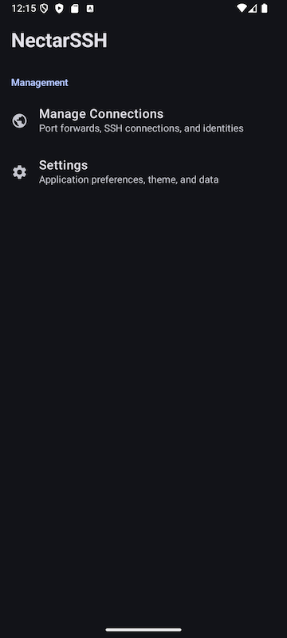
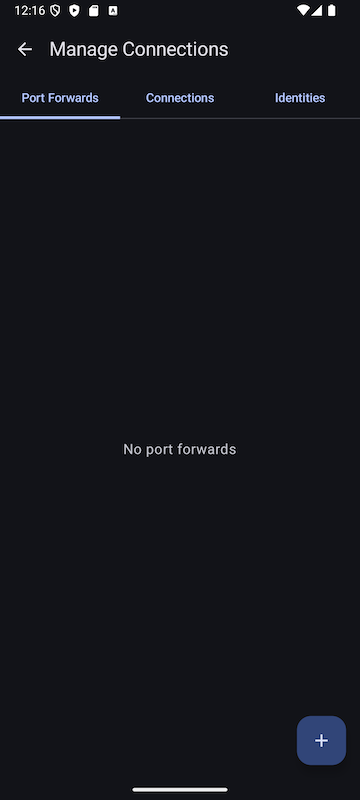

# NectarSSH

Your server in your pocket. SSH tunnels, port forwards, and a full interactive terminal — all from your phone.

 

## What can it do?

| Feature | |
|---------|--|
| **Interactive Terminal** | Full shell with colors, cursor, scrollback. Run vim, htop, whatever. |
| **Port Forwarding** | Local forwards, grouped or standalone. Reach anything behind your server. |
| **Home Screen Shortcuts** | One tap to connect. Pick from 100+ icons or use your own image. |
| **Persistent Tunnels** | Runs as a foreground service. Survives screen off, app switches, everything. |
| **Multiple Identities** | Passwords, RSA keys, Ed25519. One device, many servers. |
| **Connection Groups** | Bundle port forwards together. Connect once, forward everything. |

## Install

Grab the latest APK from [Releases](https://github.com/sr01/NectarSSH/releases/latest) and sideload it.

## Build from source

```bash
./gradlew assembleDebug
adb install app/build/outputs/apk/debug/*.apk
```

**Requires:** Android 7.0+ (API 24)

## Under the hood

- Kotlin + Jetpack Compose + Material3
- [SSHJ](https://github.com/hierynomus/sshj) for SSH
- [Termux terminal libraries](https://github.com/termux/termux-app) for terminal emulation (Apache 2.0)
- BouncyCastle for cryptography
- Coroutines + Flow for async I/O

## License

MIT
